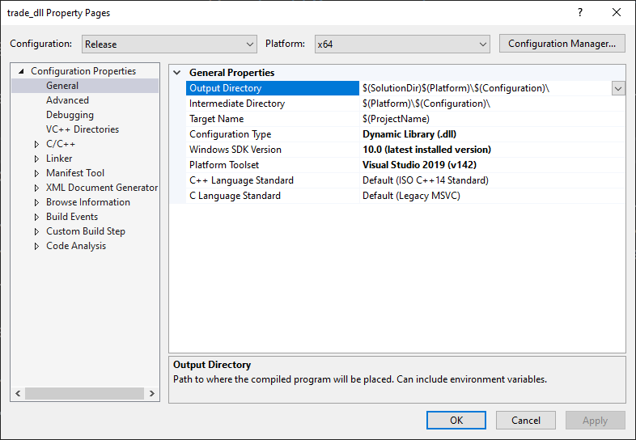
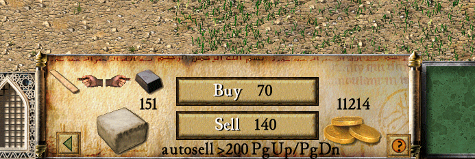
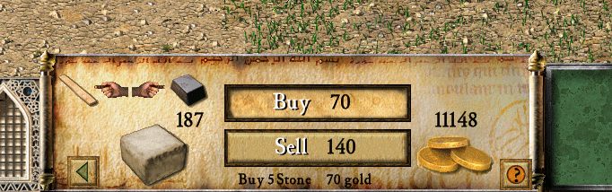

# stronghold_autosell
This mod adds adjustable automatic selling of resources in Stronghold Crusader game.
It is compatibile with:
* [Stronghold Crusader HD](https://fireflyworlds.com/games/strongholdcrusader/)
* [Stronghold Crusader Unofficial Crusader Patch](https://github.com/UnofficialCrusaderPatch/UnofficialCrusaderPatch)
## Build settings

## How to build
1. Build project in release mode using Visual Studio.
Resulting file is Release//trade_dll.dll
## How to use
1. Inject resulting file `Release//trade_dll.dll` into Stronghold Crusader process using any dll injector.
You need inject dll everytime you run the game.
## How it works
1. Automatically sells resources if their level is above a specified value(default 200).
1. Selling threshold for each resource can be adjusted in market resource view via PageUp(+10) and PageDown(-10) keys.
1. Current threshold value for resource is displayed at the bottom of the buy/sell menu as seen on  
1. Hides current treshold on hoovering buy or sell button as seen on  
1. Detects if the market is built and prohibits trading without it.
1. Injection can be removed from the game process by pressing the END key.

## To do
* [ ] disable selling resources that are prohibited by the game scenario settings
* [x] reset mod settings on every load or start game

## Screenshots 
[autoTradeView]: AutoTrade view in menu

[autoTradeHidden]: AutoTrade hide mod text on hoover over buy button
